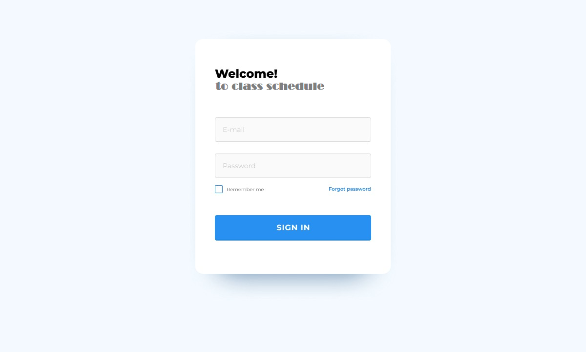
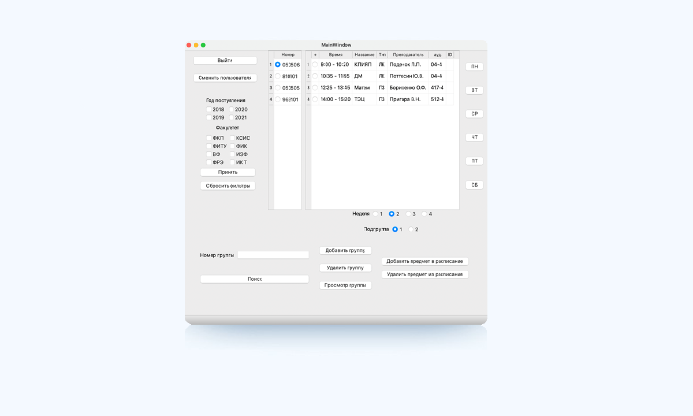
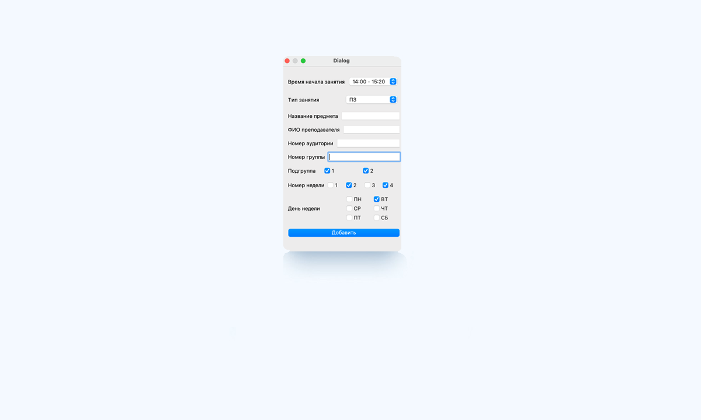
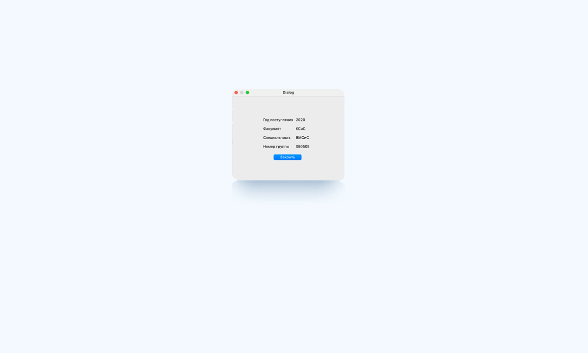

# Требования к проекту

## Содержание

[1 Введение](#1-введение)  
[1.1 Назначение](#11-назначение)  
[1.2 Бизнес-требования](#12-бизнес-требования)  
[1.2.1 Исходные данные](#121-исходные-данные)  
[1.2.2 Возможности бизнеса](#122-возможности-бизнеса)  
[1.2.3 Границы проекта](#123-границы-проекта)  
[1.3 Аналоги](#13-аналоги)  
[2 Требования пользователя](#2-требования-пользователя)  
[2.1 Программные интерфейсы](#21-программные-интерфейсы)  
[2.2 Интерфейс пользователя](#22-интерфейс-пользователя)  
[2.3 Характеристики пользователей](#23-характеристики-пользователей)  
[2.3.1 Классы пользователей](#231-классы-пользователей)  
[2.3.2 Аудитория приложения](#232-аудитория-приложения)  
[2.3.2.1 Целевая аудитория](#2321-целевая-аудитория)  
[2.3.2.1 Побочная аудитория](#2322-побочная-аудитория)  
[2.4 Предположения и зависимости](#24-предположения-и-зависимости)  
[3 Системные требования](#3-системные-требования)  
[3.1 Функциональные требования](#31-функциональные-требования)  
[3.1.1 Основные функции](#311-основные-функции)  
[3.1.1.1 Регистрация](#3111-регистрация)  
[3.1.1.2 Главное меню](#3112-главное-меню)  
[3.1.2 Ограничения и исключения](#312-ограничения-и-исключения)  
[3.2 Нефункциональные требования](#32-нефункциональные-требования)  
[3.2.1 Атрибуты качества](#321-атрибуты-качества)  
[3.2.1.1 Требования к удобству использования](#3211-требования-к-удобству-использования)  
[3.2.1.2 Требования к безопасности](#3212-требования-к-безопасности)  
[3.2.2 Внешние интерфейсы](#322-внешние-интерфейсы)  
[3.2.3 Ограничения](#323-ограничения)

# 1 Введение

## 1.1 Назначение

В этом документе описаны функциональные и нефункциональные требования к приложению «Timetable of classes». Этот
документ предназначен для команды, которая будет реализовывать и проверять корректность работы приложения.

## 1.2 Бизнес-требования

### 1.2.1 Исходные данные

В последние годы расписание приобрели значительную популярность. Множество людей пользуются расписанием практически каждый день.
Поэтому было спроектировано это приложение. Программное средство необходимо для тех, кто не может узнать расписание 
в интернете, поэтому и используют оффлайн-приложения, для того, чтобы быстро посмотреть расписания своей, или не обязательно своей, группы,
класса и т.д.

### 1.2.2 Возможности бизнеса

Множество людей желают, чтобы у них вся нужная информация была всегда под рукой без лишних блокнотиков, тетрадок и записных книжек,
здесь вам и пригодится такое приложение как расписание занятий также в приложение предусмотрена защита информации, и для того чтобы 
получить расписание принадлежащее конекретному пользователю было создано специальное окно регистрации. Помимо этого, приложение 
должно иметь весь привычный функционал всем известных приложенийтаких как добавление нового расписания, просмотр, редактирование и так далее.

### 1.2.3 Границы проекта

Приложение без регистрации не позволит пользователям просматривать актуальные расписания. Также в приложении будет необязательная регистрация,
которая позволит ставить специфичные настройки для каждого пользователя и для просмотра интерфейса приложения.

## 1.3 Аналоги

Обзор аналогов представлен в документе [analogues](analogues.md).

# 2 Требования пользователя

## 2.1 Программные интерфейсы

Информация о расписании будет браться из базы данных.

## 2.2 Интерфейс пользователя

Окно регистрации нового пользователя:
  
Главное меню приложения:  
  
Окно добавления расписания:  
  
Окно редактирования:
  
Окно вывода информации:
  

## 2.3 Характеристики пользователей

### 2.3.1 Классы пользователей

| Класс пользователей | Описание                                                                                              |
|:--------------------|:------------------------------------------------------------------------------------------------------|
| Без доступа к сети  | Пользователи, которые не принадлежат к сети. Имеют доступ к частичному функционалу   		      |
| С доступом к сети   | Пользователи, которые имеют доступ к сети. Имеют такой же функционал как и без сети                   |

### 2.3.2 Аудитория приложения

#### 2.3.2.1 Целевая аудитория

Люди любой возрастной категории, обладающие минимальными навыками работы с ПК, интересующиеся удобным расписанием

#### 2.3.2.2 Побочная аудитория

Люди которые занимаются в сфере бизнеса, заинтересованные в заработке.

## 2.4 Предположения и зависимости

Не предполагается, что пользователь имеет доступ к сети и его функционал не ограничен.

# 3 Системные требования

## 3.1 Функциональные требования

### 3.1.1 Основные функции

#### 3.1.1.1 Регистрация

**Описание:** Пользователь имеет возможность зарегистрироваться в приложении.

| Функция                              | Требования                                                                                                                                                                                                                                                                                               | 
|:-------------------------------------|:---------------------------------------------------------------------------------------------------------------------------------------------------------------------------------------------------------------------------------------------------------------------------------------------------------|
| Регистрация нового пользователя      | Приложение должно запросить у пользователя ввести личные для создания учётной записи. Пользователь должен либо ввести данные, либо отменить действие.																		          |
| Пользователь с таким		       | Приложение должно известить пользователя об ошибке регистрации и запросить ввод. 																			  								  
  именем существует.        	         Пользователь должен либо ввести псевдоним, либо отменить действие.																													  |
| Вход зарегистрированного	       | Приложение направляет пользователя на 																																	  
| пользователя в приложение.            вкладку личных уведомлений.																																		  |

#### 3.1.1.2 Главное меню

**Описание:**  Главное окно наглядно разбито на несколько блоков: блок иллюстрации списков, блок фильтрации, блок работы со списками и   блок связи с учетными записями.

| Функция                      | Требования                                                                                                                                                                                                                                                     | 
|:-----------------------------|:---------------------------------------------------------------------------------------------------------------------------------------------------------------------------------------------------------------------------------------------------------------|
| Добавление расписания        | Приложение должно предоставлять возможность для добавления нового расписания по критериям																				        |
| Блок иллюстрации списков     | Приложение должно предоставить списки групп и занятий, список относящийся к конкретной учетной записи																		                |
| Блок фильтрации              | Приложение должно предоставить возможность редактирования уже созданного расписания по конкретным критериям						                                                                                                        |
| Блок работы со списками      | Является ключевым в работе программы, благодаря этому блоку выполняются и вызывается большинство остальных окон, необходимые для нужных операций над списками.												    	|
| Блок связи с уч. записями    | Приложение должно предоставить возможность при нажатии на кнопку "Выйти" диалоговое окно, в котором пользователь может передумать о выполнении действия. 											    	        |

### 3.1.2 Ограничения и исключения

Приложение функционирует как при наличии подключения к Интернету так и без него;

## 3.2 Нефункциональные требования

### 3.2.1 Атрибуты качества

#### 3.2.1.1 Требования к удобству использования

1.Интерфейс удобный для пользования
2.Функциональные элементы не перегружают экран;

#### 3.2.1.2 Требования к безопасности

Для безопасного пользования приложением держите свои данные учетной записи, такие как логин и пароль в защищенном месте.

### 3.2.2 Внешние интерфейсы

Окна приложения удобны для долгосрочного использования пользователями:

* все панели статичны, а значит разобраться сможет любой пользователь;
* стандартная цветовая палитра не утомляет глаза.

### 3.2.3 Ограничения

1. Приложение реализовано на C++ и QML c использованием Qt Framework;
2. Данные хранятся в базе данных.
