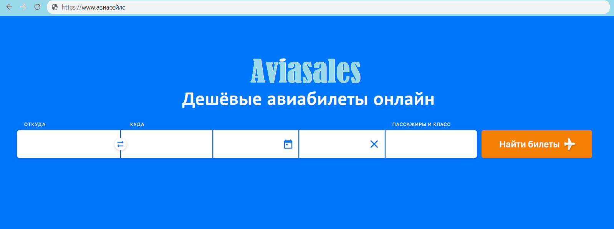
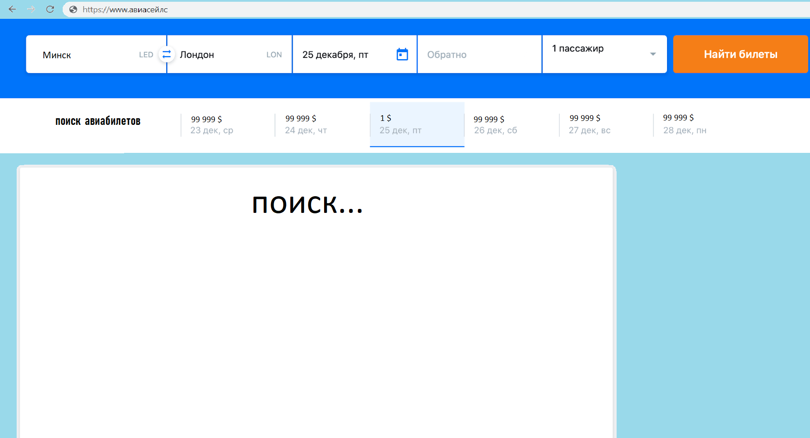
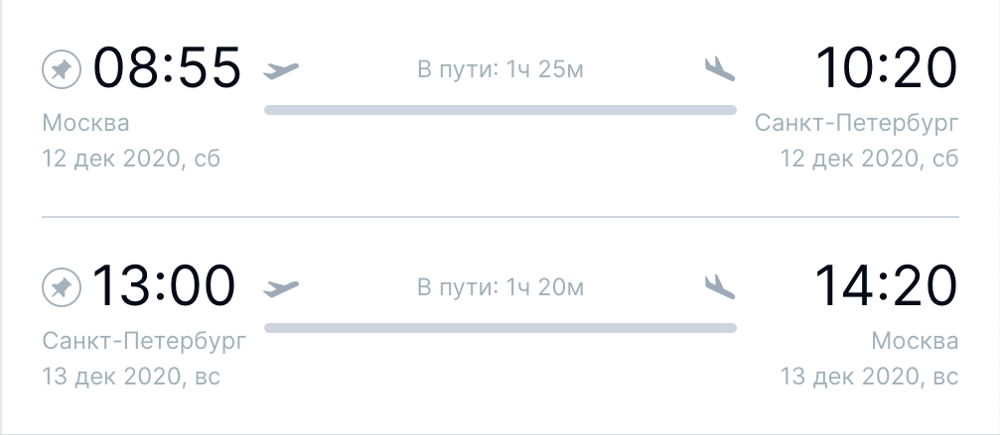

# Требования к проекту

## Содержание

[1 Введение](#1-введение)  
[1.1 Назначение](#11-назначение)  
[1.2 Бизнес-требования](#12-бизнес-требования)  
[1.2.1 Исходные данные](#121-исходные-данные)  
[1.2.2 Возможности бизнеса](#122-возможности-бизнеса)  
[1.2.3 Границы проекта](#123-границы-проекта)  
[1.3 Аналоги](#13-аналоги)  
[2 Требования пользователя](#2-требования-пользователя)  
[2.1 Программные интерфейсы](#21-программные-интерфейсы)  
[2.2 Интерфейс пользователя](#22-интерфейс-пользователя)  
[2.3 Характеристики пользователей](#23-характеристики-пользователей)  
[2.3.1 Классы пользователей](#231-классы-пользователей)  
[2.3.2 Аудитория приложения](#232-аудитория-приложения)  
[2.3.2.1 Целевая аудитория](#2321-целевая-аудитория)  
[2.3.2.1 Побочная аудитория](#2322-побочная-аудитория)  
[2.4 Предположения и зависимости](#24-предположения-и-зависимости)  
[3 Системные требования](#3-системные-требования)  
[3.1 Функциональные требования](#31-функциональные-требования)  
[3.1.1 Основные функции](#311-основные-функции)  
[3.1.1.1 Рейтинговый режим игры](#3111-рейтинговый-режим-игры)  
[3.1.1.2 ИИ](#3112-ии)  
[3.1.1.3 Анализ партии](#3113-анализ-партии)  
[3.1.1.4 Обучение](#3114-обучение)  
[3.1.1.5 Настройки](#3115-настройки)  
[3.1.2 Ограничения и исключения](#312-ограничения-и-исключения)  
[3.2 Нефункциональные требования](#32-нефункциональные-требования)  
[3.2.1 Атрибуты качества](#321-атрибуты-качества)  
[3.2.1.1 Требования к удобству использования](#3211-требования-к-удобству-использования)  
[3.2.1.2 Требования к безопасности](#3212-требования-к-безопасности)  
[3.2.2 Внешние интерфейсы](#322-внешние-интерфейсы)  
[3.2.3 Ограничения](#323-ограничения)

# 1 Введение

## 1.1 Назначение

В этом документе описаны функциональные и нефункциональные требования к веб-приложению 'Aviasales'.Этот документ 
предназначен для команды, которая будет реализовывать и проверять корректность работы приложения.

## 1.2 Бизнес-требования

### 1.2.1 Исходные данные

Большое количество людей разной возрастной категории ежедневно пользуются различными площадками поиска нужных рейсов, в том 
числе телевидение, радиовещание, брошурки, газеты и так далее. За частую приходится преодолевать различное расстояние, 
тратить уйму сил и энергии для получения нужной информации и желаемого результата. И после этого не всегда удается достичь 
задумываемого, приходится искать ответы на свои вопросы в интернете, но и здесь получают достатоное количество трудностей, и
пытаясь упростить себе задачу люди тратят много сил и времени, после чего приходит понимание того, что вопросов стало только больше,
а проблема в корне не решена.

### 1.2.2 Возможности бизнеса

Многие люди разумеется для их же удобства хотят иметь сервис, который позволит получать нужную информацию по данной теме, закупать 
авиабилеты руководствуясь ценами на различных площадках, затрачивая по минимуму время и силы. Сервис находит лучшие варианты перелётов,
которые можно оплатить через продавцов — агентства или авиакомпании. Интерфейс, спроектированный так, чтоб пользователю было легко и 
просто получить желаемое, не затрачивая лишних средств.

### 1.2.3 Границы проекта

Сервис 'Aviasales' позволит зарегистрированным пользователям найти и купить самые дешевые авиабилеты. Поиск билетов на самолёт по всем
авиакомпаниям, ведущим авиакассам и лучшие цены на авиабилеты. Принцип простой:

1.Пользователь заходит на сайт, выбирает город вылета, город прилета, даты и количество пассажиров.

2.Сервис в реальном времени запрашивает информацию по авиабилетам у сотен агентств и авиакомпаний.

3.Все собранные варианты отображаются на одной странице, начиная от самых дешевых.

4.Пользователь выбирает подходящий билет и переходит на сайт агентства или авиакомпании, где можно сделать покупку.

## 1.3 Аналоги

Обзор аналогов представлен в документе    .

# 2 Требования пользователя

Информация о рейсах будет браться с разных сервисов и источников.

## 2.1 Программные интерфейсы

Главное меню приложения:  

  

Поиск рейсов:  

  

Дополнеительная информация о рейсе:  

  

## 2.3 Характеристики пользователей

### 2.3.1 Классы пользователей

| Класс пользователей | Описание                                                                                              |
|:--------------------|:------------------------------------------------------------------------------------------------------|
| Без доступа к сети  | Пользователи, не имеют доступ к сервису.							      |
| С доступом к сети   | Пользователи, которые имеют доступ к сети. Имеют доступ к полному функционалу                         |

### 2.3.2 Аудитория приложения

#### 2.3.2.1 Целевая аудитория

Люди любой возрастной категории, обладающие минимальными навыками работы с ПК и в сети интернет, интересующиеся покупкой авиабилетов.

#### 2.3.2.2 Побочная аудитория

Люди которые занимаются в сфере бизнеса, заинтересованные в заработке на продаже авиабилетов.

## 2.4 Предположения и зависимости

Сервис не работает при отсутствии подключения к Интернету;

# 3 Системные требования

## 3.1 Функциональные требования

### 3.1.1 Основные функции

#### 3.1.1.1 Поиск авиабилетов (главное меню)

**Описание:** Пользователь имеет возможность поиска, сравнения и покупки авиабилетов.

| Функция                              | Требования                                                                                                                                                                                                                                                                                               | 
|:-------------------------------------|:---------------------------------------------------------------------------------------------------------------------------------------------------------------------------------------------------------------------------------------------------------------------------------------------------------|
| Выбор места отправления              | Приложение предоставляет на выбор города откуда вы желаете начать отправление.                                                                                                                                                                                                             		  |
| Выбор места прибытия 	               | Приложение предоставляет на выбор города куда вы желаете прибыть.                                                                                                                                                                                 				              		  |
| Выбор даты		               | Приложение предоставляет встроенный календарь с датами отправления.                                                                                                                                                       										  |
| Выбор обратного рейса	               | Приложение предоставляет возможность обратного отправления в один клик(необязательное поле).																										  |
| Выбор количества пассажиров          | Приложение выбрать количество мест(пассажиров) для резервирования места.                           																									  |

#### 3.1.1.2 Поиск авиабилтов (окно выбора)

**Описание:** Пользователь имеет возможность редактирования, сравнения и покупки конкретного авиабилета.

| Функция                              | Требования                                                                                                                                                                                                                                                                                               | 
|:-------------------------------------|:---------------------------------------------------------------------------------------------------------------------------------------------------------------------------------------------------------------------------------------------------------------------------------------------------------|
| Редактирование места отправления     | Приложение предоставляет редактирование города откуда вы желаете начать отправление.                                                                                                                                                                                                                     |
| Редактирование места прибытия        | Приложение предоставляет редактирование города куда вы желаете прибыть.                                                                                                                                                                                 				     		  |
| Редактирование даты		       | Приложение предоставляет встроенный календарь с датами отправления для редактирования.                                                                                                                                                       								  |
| Редактирование обратного рейса       | Приложение предоставляет возможность обратного отправления в один клик(необязательное поле).																										  |
| Редактирование количества пассажиров | Приложение предоставляет редактировать количество мест(пассажиров) для резервирования места.                           																						  |
| Выбор конкретного билета             | Приложение предоставляет на выбор авиабилеты с указанием даты и цены.        																												  |

#### 3.1.1.3 Отслеживание рейса

**Описание:** Пользователь имеет возможность отследить приобретенный рейс.

| Функция                              | Требования                                                                                                                                                                                                                                                                                               | 
|:-------------------------------------|:---------------------------------------------------------------------------------------------------------------------------------------------------------------------------------------------------------------------------------------------------------------------------------------------------------|
| Отслеживание			       | Приложение предоставляет информацию о рейсе.                                                                                                                                                                                                                     |
| Закрепление 			       | Приложение предоставляет возможность закрепить более важный рейс для удобсвта.                                                                                                                                                                                 				     		  |
| Удаление рейса		       | Приложение предоставляет возможность отменить рейс.                                                                                                                                                       								  |

### 3.1.2 Ограничения и исключения

Приложение функционирует только при наличии подключения к Интернету;

## 3.2 Нефункциональные требования

### 3.2.1 Атрибуты качества

#### 3.2.1.1 Требования к удобству использования

1. Интерфейс удобный для пользования

2. Функциональные элементы не перегружают экран;

#### 3.2.1.2 Требования к безопасности

Для совершения покупок требуется
предпринять дополнительные меры безопасности во избежание потери денежных средств.

### 3.2.2 Внешние интерфейсы

Окна приложения удобны для долгосрочного использования пользователями:

* функциональные элементы не утомляют глаза.
* стандартная цветовая палитра не утомляет глаза.

### 3.2.3 Ограничения

Приложение реализовано на Python/Tornado    																												  
